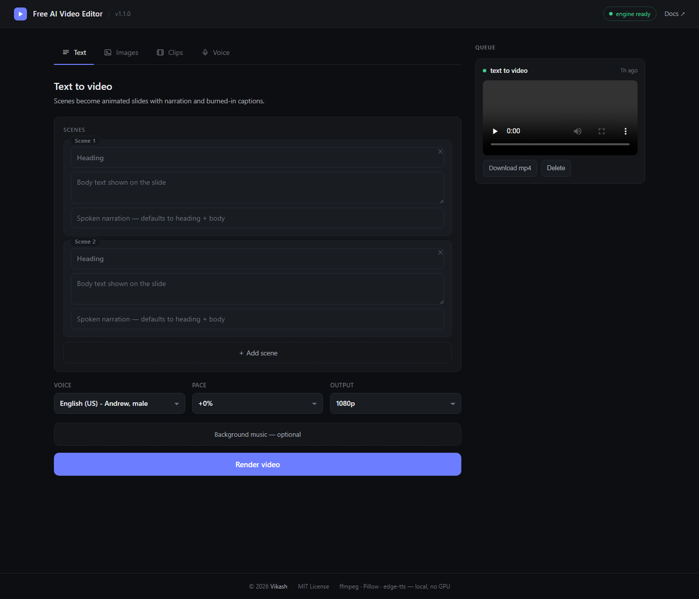
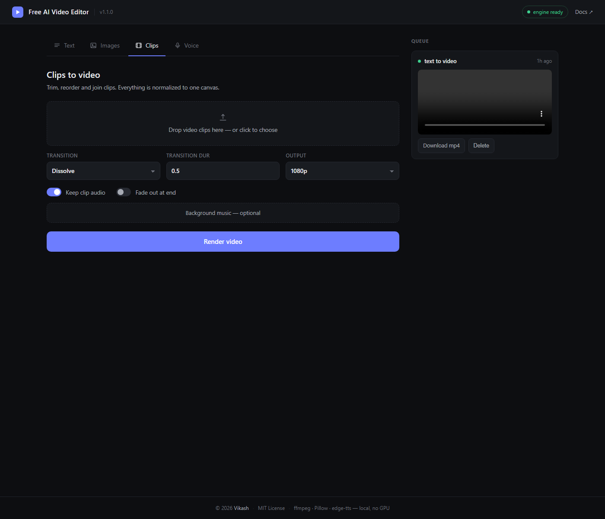
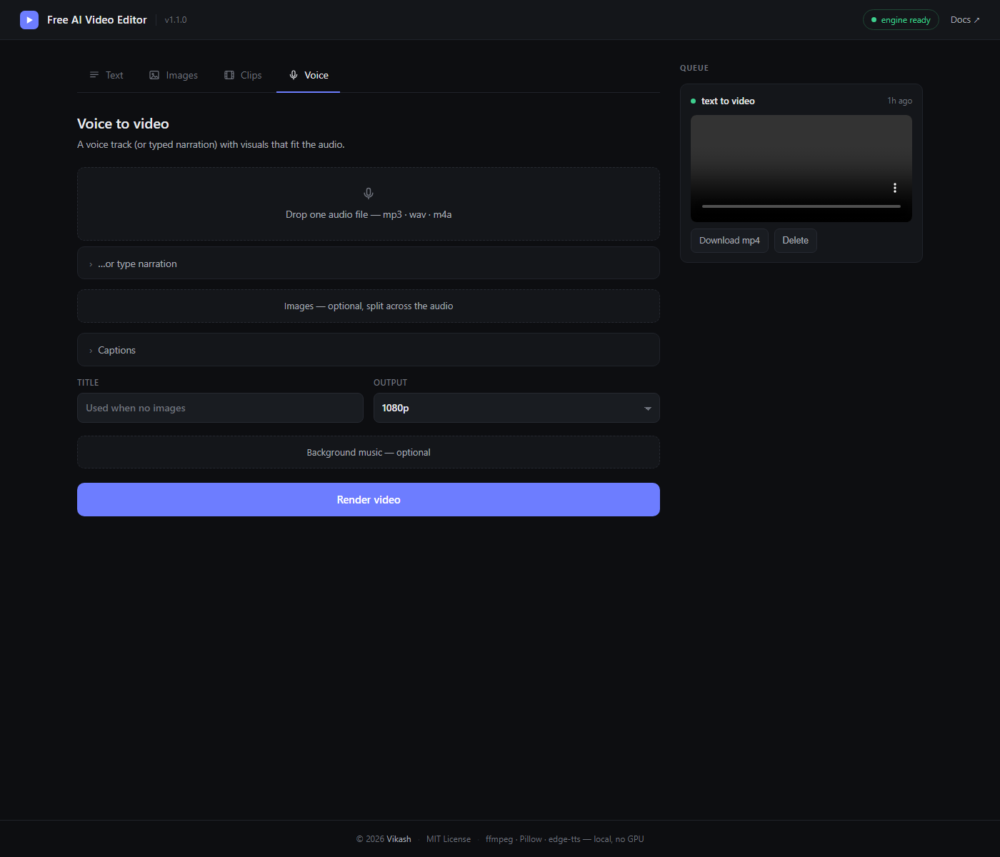

<div align="center">

# 🎬 Free AI Video Editor

**Local, CPU-only web video studio — text, images, clips & voice become finished MP4s.**

No GPU · no CUDA · no paid APIs · nothing leaves your machine except the free TTS call.

[](https://github.com/vikash-iwe3/Free-AI-Video-Editor/actions/workflows/ci.yml)
[](LICENSE)
[](https://www.python.org/downloads/)
[](#-quick-start)
[](https://github.com/vikash-iwe3)



</div>

---

## Previews

| | |
|:--:|:--:|
| <br>**Text → video** — scenes become narrated, animated slides | <br>**Images → video** — Ken-Burns montage with spoken captions |
| <br>**Clips → video** — trim, reorder, crossfade, BGM | <br>**Voice → video** — visuals auto-fit to any voice track |

---

## Contents
- [Previews](#previews)
- [Why](#why)
- [Features](#features)
- [Quick start](#-quick-start)
- [The four pipelines](#the-four-pipelines)
- [Output specs](#output-specs)
- [API for scripting](#api-for-scripting)
- [Architecture & design notes](#architecture--design-notes)
- [Development & tests](#development--tests)
- [Troubleshooting](#troubleshooting)
- [Limitations & roadmap](#limitations--roadmap)
- [Contributing / License / Security](#contributing--license--security)

## Why

Most "AI video" tools are cloud subscriptions that need a GPU-grade pipeline
or lock your media behind an account. Free AI Video Editor runs entirely on your own
box: **ffmpeg + Pillow + free neural voices**. It was born editing real promo
footage (see the multi-beat voice-over workflows it handles), so every design
call favors repeatable, loudness-normalized, upload-ready output over toys.

## Features

| | |
|---|---|
| 🖥 **100% local rendering** | every frame is produced by ffmpeg `libx264` on your CPU — no queue, no upload, no expiry |
| 🗣 **14 neural voices** | en-US/UK/IN, hi-IN, es, fr, de, zh, ja, ar — free via Edge TTS (only network call; offline fallback: supply your own voice file) |
| 🔤 **Script-aware captions** | burned-in, box-backed, auto-wrapped; Latin, **Devanagari** and CJK render correctly (font auto-resolution per script) |
| 🎞 **Real assembly tools** | trims, reorder, crossfades (video *and* audio), Ken-Burns motion, fade-outs, BGM beds |
| 🔊 **Broadcast-safe audio** | loudness-normalized to -16 LUFS, 48 kHz stereo AAC |
| 📁 **Durable job system** | per-job workdirs + JSON state → survives restarts, live progress, one-click download |
| 🔌 **Scriptable** | tiny JSON API + `curl`/`requests` friendly |
| 🧪 **Tested** | `pytest` renders real MP4s; CI matrix on Linux & Windows (py 3.10 / 3.12) |

## ⚡ Quick start

**Requirements:** Python 3.10+ and `ffmpeg`/`ffprobe` on PATH.

```bash
# Windows
cd free-ai-video-editor
run.bat

# Linux / macOS
./run.sh
```

…or manually:

```bash
pip install -r requirements.txt
python app.py
```

Open **http://127.0.0.1:8137**. The header pill shows whether ffmpeg was found.

<details>
<summary>Optional: auto speech-to-text captions (Voice → Video)</summary>

```bash
pip install -r requirements-asr.txt   # faster-whisper, CPU int8
```

The first use downloads a small model once; after that it's fully offline.
</details>

## The four pipelines

### 📝 Text → Video
Type scenes (heading + body + narration). Each becomes an animated slide
(6 gradient palettes, auto-fit headings, circuit-line texture) sized to its
spoken narration, joined with crossfades, captions burned in, BGM optional.

### 🖼 Images → Video
Drop images in order; add a caption per image. Captions can be *spoken* by the
chosen voice **and** burned in. Motion: slow zoom-in / left / right pans
(2× supersampled `zoompan`, so no sub-pixel jitter). Transitions: dissolve,
fade, or hard cut.

### 🎞 Clips → Video
Upload video clips with per-clip in-point + duration. Everything is
normalized to one canvas/fps/pixel-format, joined with crossfades (or cuts),
clip audio kept/muted/volume-adjusted, optional BGM underneath, fade-out
optional.

### 🎙 Voice → Video
Give it **a voice track** (mp3/wav/m4a…) *or* typed narration for the AI voice.
Optional images are auto-split across the audio's length; if you leave them
out, a branded title slide is generated. Captions from your text lines
(evenly spread) or offline ASR. Output always matches the audio duration.

## Output specs

| | |
|---|---|
| Container | MP4 (H.264 High + AAC, `+faststart`) |
| Resolutions | 480p · 720p · 1080p (16:9) |
| Frame rate | 30 fps CFR |
| Audio | 48 kHz stereo, loudness-normalized `-16 LUFS / TP -1.5` |
| Encoding | CPU `libx264 -preset veryfast -crf 20` |
| Fonts | per-script auto: Arial/Nirmala/YaHei (Win) → DejaVu/Noto/Liberation (Linux) → Helvetica/PingFang (mac) |

## API for scripting

| Method | Route | Purpose |
|---|---|---|
| `GET` | `/api/health` | ffmpeg presence + paths |
| `GET` | `/api/meta` | version, voices, resolutions |
| `POST` | `/api/upload` | multipart `files` → `uploads[{id,name,kind}]` |
| `POST` | `/api/jobs` | `{"kind": ..., "params": {...}}` → `{"id"}` |
| `GET` | `/api/jobs` | all jobs (newest first) |
| `GET` | `/api/jobs/<id>` | status / stage / progress |
| `GET` | `/api/jobs/<id>/result` | rendered MP4 (range-requestable) |
| `DELETE` | `/api/jobs/<id>` | remove job + output |

Job `kind`s: `text-to-video` · `images-to-video` · `clips-to-video` · `voice-to-video`.

**Text → video in one shot:**

```bash
ID=$(curl -s -F files=@cover.png http://127.0.0.1:8137/api/upload \
     | jq -r .uploads[0].id)

curl -s -X POST http://127.0.0.1:8137/api/jobs -H 'content-type: application/json' -d '{
  "kind": "text-to-video",
  "params": {
    "scenes": [
      {"heading": "Alpha Brain", "body": "Your AI command center",
       "narration": "Meet Alpha Brain, the command center for your entire AI stack."},
      {"heading": "Free Models", "body": "Switch between frontier models at zero cost",
       "narration": "All the frontier models, free and zero setup."}
    ],
    "voice": "en-US-AndrewNeural", "rate": "+0%", "resolution": "1080p"
  }}' | jq -r .id
```

Then poll `GET /api/jobs/<id>` until `status == "done"` and download
`/api/jobs/<id>/result`.

Parameter reference per kind → see `core/jobs.py` (each pipeline documents its
keys in the first ten lines) or mirror the UI's network calls.

## Architecture & design notes

```
free-ai-video-editor/
├── app.py            Flask server + JSON API
├── run.bat|run.sh    launchers (install deps + start)
├── core/
│   ├── util.py       ffmpeg/ffprobe runners, probe, per-script font resolution
│   ├── tts.py        edge-tts with retry; 14 voices
│   ├── slides.py     Pillow slide generator (language-aware fonts, fit/wrap)
│   ├── render.py     engine: segments, Ken-Burns, xfade/acrossfade, drawtext,
│   │                 narration concat, BGM mix, loudnorm, fade-out
│   ├── jobs.py       threaded job manager + the 4 pipelines
│   └── asr.py        optional faster-whisper auto-captions
├── static/           single-page app (vanilla JS, no build step)
├── tests/            pytest suite (renders real MP4s, hermetic)
└── workspace/        runtime — uploads / jobs / outputs (gitignored)
```

Design rules worth knowing before you edit (all enforced by tests/CI):

1. **No absolute paths inside filtergraphs.** Every ffmpeg call runs with
   `cwd=<job dir>` and references `textfile=`, `fontfile=`, segment files by
   *bare filename*. Windows drive-letter colons (`C\:`) break filtergraph
   escaping in several ffmpeg builds — this structure makes that impossible.
2. **`-map` discipline**: once any explicit `-map` exists, *all* streams must
   be mapped — segments always carry video + silent-aac so nothing gets
   dropped by concat/xfade later.
3. **Uniform segments**: everything is normalized to one canvas/fps/pix_fmt
   *before* joining, so transitions never negotiate codecs.
4. **Fallback over failure**: dissolve graphs that any ffmpeg build rejects
   automatically fall back to a hard cut instead of erroring.

## Development & tests

```bash
pip install -r requirements.txt -r requirements-dev.txt
pytest -q          # ~9 tests, renders real MP4s into tmp dirs, no network
python app.py      # or with auto-reload for dev
```

CI runs the same suite on **ubuntu + windows** for **py3.10 + py3.12**
([.github/workflows/ci.yml](.github/workflows/ci.yml)).

## Troubleshooting

| Symptom | Fix |
|---|---|
| Header says **"ffmpeg missing"** | install ffmpeg and re-open the terminal (PATH changes don't reach running processes) — e.g. `winget install Gyan.FFmpeg`, `brew install ffmpeg`, `sudo apt install ffmpeg` |
| Job stuck / `TTS failed after N attempts` | the Edge voice endpoint is rate-limiting or you're offline — retry, switch voice, or use Voice→Video with your own audio file (fully offline) |
| ASR model download fails | behind a firewall — use `caption mode: my text lines` instead |
| Captions show boxes/□ | add a font that covers the script and drop it in `workspace/static_fonts/` (Nirmala UI for Hindi, Noto CJK for Chinese/Japanese) |
| Port 8137 busy | edit `port` at the bottom of `app.py` |
| Renders are slow | drop resolution to 720p/480p; it's pure CPU x264 (`veryfast`) |
| Long clips OOM/fail on Windows | keep under ~2 GB uploads; render from local files, not network drives |

## Limitations & roadmap

- 16:9 only today — **planned:** 9:16 vertical + 1:1 presets
- BGM is laid under audio; **planned:** automatic ducking
- Captions use supplied/ASR text; **planned:** karaoke-style word highlight
- Single-user localhost by design — see [SECURITY.md](SECURITY.md) before
  exposing it

## Credits

**Designed, built and maintained by [Vikash](https://github.com/vikash-iwe3).**
Copyright © 2026 Vikash — released under the MIT License.

## Contributing / License / Security

- PRs welcome — see [CONTRIBUTING.md](CONTRIBUTING.md) (tests required for
  pipeline changes).
- [CHANGELOG.md](CHANGELOG.md) · [SECURITY.md](SECURITY.md) · [MIT © 2026](LICENSE)

*Built with [ffmpeg](https://ffmpeg.org/), [Pillow](https://python-pillow.org/),
[Flask](https://flask.palletsprojects.com/) and
[edge-tts](https://github.com/rany2/edge-tts). Not affiliated with Microsoft.*
